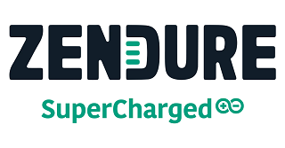

# ioBroker.zendure-solarflow

**Tests:** 

## Zendure Solarflow adapter for ioBroker

This project is an ioBroker Adapter to read data from the Zendure Solarflow Cloud API.

## Donate

If you find the adapter useful for you and want to support my work, feel free to donate by Paypal. Thank You!
(this is an personal Donate link for Nograx, in no relation to the ioBroker Project!) 

## Features

- Get all telemetry data from your Solarflow devices, also those not visible in the offical app - like battery voltage
- Control your Solarflow HUB like in the offical app. Most of the settings are available.
- Control the output limit - you are not limited to use a Shelly Pro EM to realize a zero feed-in. You can also design more complex scenarios via script or blockly in ioBroker.
- Stop input if one battery drops into low voltage (battery protect). Works only when setting the output limit via the adapter
- Control more than one Solarflow at the same time!
- Get more precise calculations!
- Works with all Zendure SolarFlow devices: HUB1200, Hyper2000, HUB2000 and AIO!

## Offline-Mode (Disconnect from Zendure Cloud)

As a new feature you can disconnect the Zendure device from the Cloud. You can either use the [Solarflow Bluetooth Manager](https://github.com/reinhard-brandstaedter/solarflow-bt-manager) from Reinhard Brandstätter or my own Windows Tool [Zendure Cloud Disconnector](https://github.com/nograx/zendure-cloud-disconnector) to disconnect the device from the cloud. It's also possible to redirect DNS requests with your router from "mq.zen-iot.com" to your own MQTT server!

Both tools connect to the Zendure device via bluetooth and simply sets the internal MQTT url to a new url/ip you have to provide. Currently you are forced to use the default MQTT port 1883 on your server. You are also forced to deactivate authentication on the MQTT server as the Zendure device use a hardcoded password.

If the Zendure device communicates with your MQTT server, you can connect this ioBroker adapter to the same MQTT instance. You have to provide the device model and the device key (which is shown in the Zendure Cloud Disconnector app).

You can still do firmware updates with the official Zendure app via bluetooth and use both bluetooth tools to reconnect the device to the cloud!

## Notes

1. Please deactivate/uncheck all modes in the Zendure App, otherwise it is not possible to set the output limit! You can also set "autoModel" to 0 via control folder in adapter/objects.

   

2. You will be logged out of the official iOS or Android App after logging in with the ioBroker adapter. This is a normal behavior. As a workaround you can create an second Zendure account with another e-mail and grant access to your Solarflow HUB to this account. Then use the second account for ioBroker / the Zendure Solarflow adapter. This is not working für new devices like SF 2400 AC or SF 800 (Pro).

## Credits

Credits goes to https://github.com/reinhard-brandstaedter/solarflow which helped a lot with the knowledge about the MQTT server from Zendure! Thanks!

## Changelog
### 2.0.0-alpha.0 (2025-07-18)

- Breaking Change: Add control parameter 'setDeviceAutomation' which emulates Zendure's Smart Matching mode. Since there were concerns that setting limits would be stored in the flash memory, I recommend using this device automation instead of 'setInputLimit'/'setOutputLimit' from now on. You can use negative values for charging and positive for feed in.

### 1.15.4 (2025-07-17)

- Add smart mode control parameter for more devices

### 1.15.3 (2025-07-17)

- Match case sensitive product key for SF 2400 AC and SF 800 in settings if local mode is used
- Add sensor and control of "SmartMode"

### 1.15.2 (2025-07-14)

- Fix missing SF 800 & 2400 AC in local mode settings

### 1.15.1 (2025-07-11)

- Fix missing Solar Input 3 & 4 on Solarflow 800 Pro
- Fix 'packPower' state did not set to 0 if no input/output

### 1.15.0 (2025-06-27)

- Add 'packPower' state, which shows combined power from (packInputPower and outputPackPower). Discharging will be shown with a negative value.
- Add 'hyperTmp' to Solarflow 800 devices in hope this will show the temperature of the Solarflow 800 (can not test it due to lack of test device).

## License

MIT License

Copyright (c) 2025 Peter Frommert

Permission is hereby granted, free of charge, to any person obtaining a copy
of this software and associated documentation files (the "Software"), to deal
in the Software without restriction, including without limitation the rights
to use, copy, modify, merge, publish, distribute, sublicense, and/or sell
copies of the Software, and to permit persons to whom the Software is
furnished to do so, subject to the following conditions:

The above copyright notice and this permission notice shall be included in all
copies or substantial portions of the Software.

THE SOFTWARE IS PROVIDED "AS IS", WITHOUT WARRANTY OF ANY KIND, EXPRESS OR
IMPLIED, INCLUDING BUT NOT LIMITED TO THE WARRANTIES OF MERCHANTABILITY,
FITNESS FOR A PARTICULAR PURPOSE AND NONINFRINGEMENT. IN NO EVENT SHALL THE
AUTHORS OR COPYRIGHT HOLDERS BE LIABLE FOR ANY CLAIM, DAMAGES OR OTHER
LIABILITY, WHETHER IN AN ACTION OF CONTRACT, TORT OR OTHERWISE, ARISING FROM,
OUT OF OR IN CONNECTION WITH THE SOFTWARE OR THE USE OR OTHER DEALINGS IN THE
SOFTWARE.
